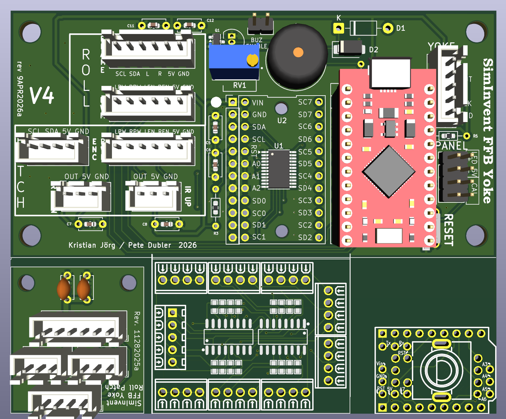

This folder contains KiCAD and GERBERS for manufacturing all PCBs in a combined fashion. This will save some cost for individual boards, but will require you to cut the boards by yourself. Perhaps with the use of a Dremel with a cutting disc or similar tool.

