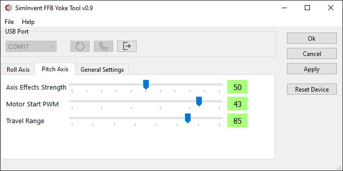

> [!Note]
> ***This project is under development and not yet ready for release!***

# SimInvent FFB Yoke
A Force Feedback Yoke based on 775 DC motors and an Arduino (SparkFun) Micro Pro microcontroller. 
Probably the most feature complete and low cost implementation anywhere!

## Fork with AS5600 magnetic encoders, minimized footprint and new features
This is a fork of [Gagagu Arduino FFB Yoke 2.0 project](https://github.com/gagagu/Arduino_FFB_Yoke). The goals of this fork was to add new features, achieve a smaller footprint, use cheaper and use more accurate AS5600 magnetic encoders and maximize pitch travel distance.

# Documentation
All build guides and documentation for the 3D printed parts, electronics and software is in the [Wiki section](https://github.com/barsk/Arduino_FFB_Yoke/wiki/Home)!

# Design and features
 
  

* Magnetic AS5600 encoders featuring 12 bit accuracy
* Removed the planetary gear in roll (x) axis which introduces backlash (slop), friction and considerable weight increasing mass and inertia. Replaced with a 56T pulley, 12T motor drive. That gives a 4.7 gear ratio which is quite enough for roll forces and provides a more nimble, lively feel than the old design. 
* Reduced footprint (400 x 275 x 100 mm).
* New CAD design with focus on easy printing and assembly.
* Pitch travel up to 165 mm with 800 mm belt on pitch (Y) axis.
* No 74HC165 mux in main PCB.
* Default centering Spring force (can be disabled) when non-FFB games are played.
* Configurable pitch travel range in the settings tool.
* Configurable max velocity setting to stop overspeed on unloaded (i.e hands off) yoke. When there are strong forces and not holding the yoke it can get a high speed that when slamming into a physical end stop may damage the yoke itself (or you). This configurable setting detects high velocity and brakes the motor until speed decreases. If hands are on yoke and kept in control, the FFB forces are in full unhindered effect.
* Yoke controller is remixed so that only 3 mm brass thread melt-ins is used. The mount bracket is updated for strength.
* Calibration method is completely revamped. It runs automatically on first start to find the endstops (IR sensors) at the extremes of the axis travel. It can also be manually started by a button at any time. 
* The calibration data is stored in EEPROM and recalled on subsequent reboot. Data is read from EEPROM and as the encoder reads the *absolute* position directl, roll axis calibration can be fully restored instantly. The pitch axis, since the axis rotatates more than one revolution needs a reference and moves to the to the innermost IR sensor - and calibration is restored.
* Chain link. To prevent breakage of the cabling a chain link is used in the design. This will give all cables from the yoke handle and frame sensors a controlled bend characteristic with a big radius preventing acute bending and breakage. 
* A nice looking 3D printed casing with plenty of cooling slots for ventilation is part of the design and fully integrated. The casing is split up into four parts plus the front and back panels which is split in two each, providing a fully printable design despite its large size. The parts are assembled with (printed) dowels and glued together.

### New settings tool
A new settings tool written in Python and Qt6. It should also be **cross platform compatible**, e.g. Linux. *Untested ATM*. The tool features a simplified and sleek experience and removes a lot of unnecessary settings. It features a new robust and fast serial protocol.

### 3D printed parts
No 3D printed parts are the same from the Gagagu/jwryan4 project. Every part has been redesigned with focus on easy printing, strength, functionality and minimal footprint. The IR-based end-stop sensors are now integrated into the actual design in a way that need no careful positioning as before.

### Firmware
The firmware code is loosely based on the orginal design, but heavily modified and enhanced with new features and also updated for the new AS5600 encoders and a TCA9548 I2C mux. With as much optimizations as possible it was possioble to squeeze all the features into the Atmega32u4 32 KB Flash ROM of the Arduino Pro Micro with just about 0.4% space left. :)

### Electronics and PCB (circuit boards)
The original yoke controller PCB and the main PCB from Gagaus's project is still used here.
Since the new encoders uses only **two** GPIO pins and the unnecessary check for 24V was removed we get enough pins to wire all inputs directly to the Arduino, **not needing** the 74HC165 multiplexer chip in the orginal design. Instead we put some jumper wires on the main PCB in the empty 74HC165 component holes to complete the connections directly. By removing the mux we reduce the complexity of the firmware code and improve responsiveness. The two 74HC165D surface mounted chips are still used in the yoke PCB boards as before.

In a future release I may replace the main PCB board with the current requirements.  

### FFB Effects
 The actual FFB effects are still based on the [FINO](https://github.com/jmriego/Fino) project and mostly identical to original project. One addition is a configurable default centering Spring force in action when playing non-FFB games.

 For games that themselves handles standard FFB effects such as IL2 and DCS the yoke should work right out of the box.

 #### Microsoft Flight Simulator 2020/2024, Xplane and others without FFB effects
 Since MSFS and others do not have any FFB effects implemented we have to rely on external software to interpret telemetry data from the sim and create effects for that accordingly. 
 
 * [XPForce](https://www.fsmissioneditor.com/product/xpforce/) which works for MSFS, Xplane, Flight Sim world, Prepar3D. 
 * [FSForce](https://www.fs-force.com/) Another tool for FSX, FSX-SE, P3D & FSW.
 
 I am not affiliated with these softwares, nor is this in any way a comprehensive list, there may be other options. But these are the only ones I found at the time of writing. Let me know if you know of other programs and I will put those on this list. (Raise an Issue).

### Assembly
For easy assembly there is a drill template for the bottom board that can be printed in 1:1 scale and layed out on the board to easily lay out the components in their specific positions.

Another method it a printable "bracket" that can be used to position the right rail correctly. The other parts will then be easy to postition relatively that rail or the edge of the board. This method is described in the Assembly wiki.

A third method is to use the STEP file of the board with all holes to machine the board on for instance CNC routers.

## Limitations and cautions
Low cost and cheaper options has some drawbacks that needs to be taken in consideration before building this kind of equipment.

* DC motors are not as efficent as brushless BLDC motors. They overheat sooner and have less torque.  
* There is more cogging sensation in the rotation of these motors than with BLDC (that can use anti-cogging algorithms in the motor drivers to counter the effect)

However, the motors (775 DC) and BTS7960 43A drivers are easy to find and come at a very low cost. BLDC motors and drivers are at the next level cost wise. And what we achieve with these components is pretty impressive!

> [!Note]
> Just keep in mind the weaknesses of the design and do not use strong forces sustained for a prolonged time as this can overheat the motors. I recommend using heat sinks on the motors and a fan controller that kicks in at about 40 centigrades. When you hear the fan power up, you know you are pushing it. That said, when flying normally with the aircraft properly trimmed this practically never occurs. Heat sinks, fan controllers and fans are all in the Part List (see [Wiki section](https://github.com/barsk/Arduino_FFB_Yoke/wiki/Home)).

## Use at your own risk. 
> [!Caution]
> DISCLAIMER! I am not responsible for any damage or injury to man or machine. Be careful when handling electric installations, electronics and mechanics. If handling electrical installation (230V) by yourself is not legal or you feel unsure of your competence, take proffessional help!  
The motors are quite strong and can cause serious injuries if not handled with great caution. The yoke handle can move very quickly when power is applied. Also be aware of moving parts, belts and pulleys.

### It is not allowed to use this project commercially!
> [!Note]
> If you want to use this project commercially please contact me.

## References
### Some of the Github projects this is based on.
* [FINO](https://github.com/jmriego/Fino)
* [ArduinoJoystickWithFFBLibrary](https://github.com/YukMingLaw/ArduinoJoystickWithFFBLibrary)
* [Rob Tillaart, AS5600](https://github.com/RobTillaart/Arduino/tree/master/libraries/AS5600)
* [Rob Tillaart, TCA9548](https://github.com/RobTillaart/Arduino/tree/master/libraries/TCA9548)

### Thingiverse
* [Cadet Yoke v2.0](https://www.thingiverse.com/thing:4884092)
* [Ender 3 Cable Chain](https://www.thingiverse.com/thing:2920060)
