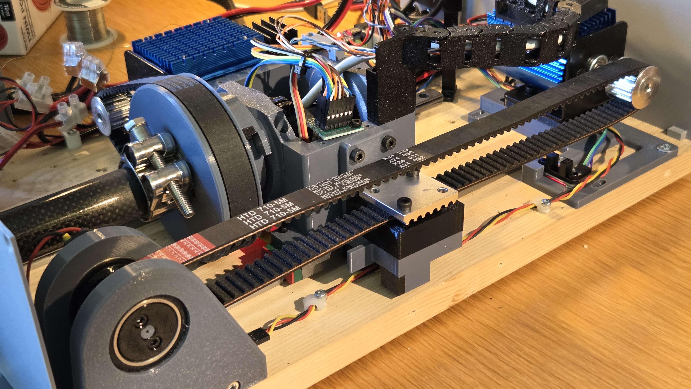
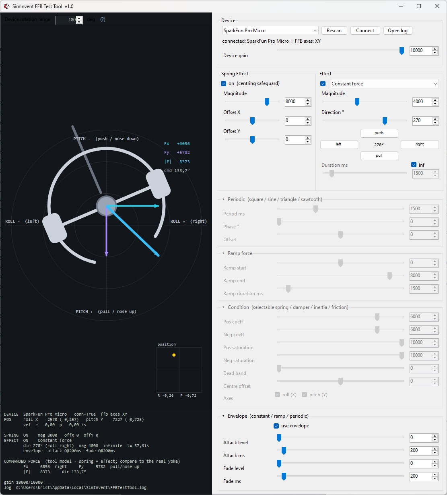
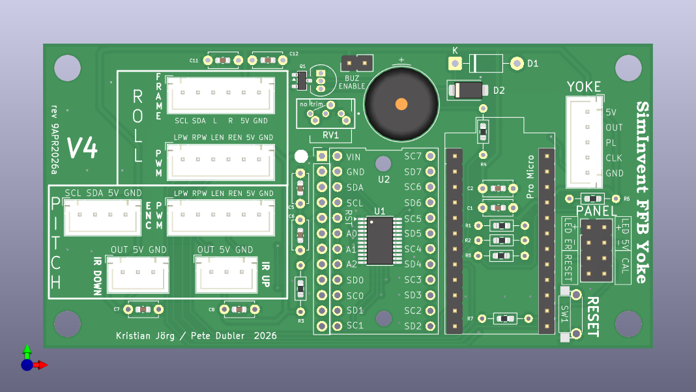
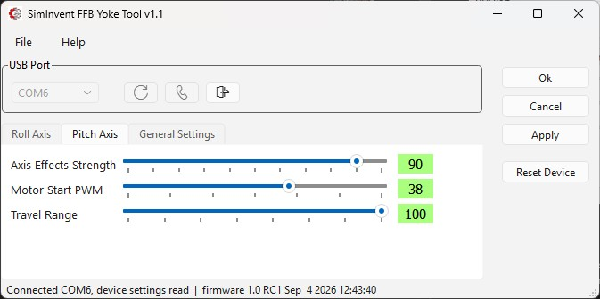

# SimInvent FFB Yoke 
A Force Feedback Yoke based on 775 DC motors and an Arduino (SparkFun) Micro Pro microcontroller. 

This is a fork of [Gagagu Arduino FFB Yoke](https://github.com/gagagu/Arduino_FFB_Yoke). The goals of this fork was to lower total cost, add new features, achieve a smaller footprint, use cheaper and use more accurate AS5600 magnetic encoders and maximize pitch travel distance.

# Documentation
***All build guides and documentation for the 3D printed parts, electronics and software are in the [Wiki section!](https://github.com/barsk/Arduino_FFB_Yoke/wiki/Home)***

---

> # Version 1.0 Release
> First public feature complete release with a **host of new features and performance**
>
> ## Firmware
> The firmware is now **highly optimized** compared to the previous version.
> It is now **100% compliant** with the standard Microsoft USB PID 1.0 specification with the following notable changes and bug fixes:
> * Force loop rate runs about  **2.5 times as fast** due to optimizations in every part of the firmware - 
> * Sine lookup table with interpolation replaces the computationally expensive sin() function in the force loop  - Contributing 45% of the speedup in the force loop
> * Effect direction now follows the DirectInput specification fully - Force directions was previously **inversed** in some situations
>* Multi-second FFB command lag removed when several effects were playing simultaneously with high framerate - 
> Due to inefficient USB protocol reads the input queue could build up and cause multi second lag
> * Effects no longer cancel or distort each other under load - The force calculator routine summed up effect forces 
> incorrectly causing an internal integer overflow
> * Coasting at idle - The motor output stage was driven even when idle, so the yoke was efffectively braked when zero force was applied. This has now been fixed, at 0 force, the output stage disbles leaving the yoke unpowered.
> * Handling non-linear motor response - The 775 motor driven straight from a PWM from 0-255 will yield a non-linear response. First at PWM=~25-40 the axis will start to move at all. Not handled this will create a huge deadband. We have previously handled this in the Setting tool with a "Motor Start Power" to define a starting point from which the effects should start, that settles the starting point, but the response *over* that setting will be non-linear with an initial bump unrealistically amplifying small effect forces. There are now settings in the firmware to configure the handling of this. See [Handling non-linear motor response](https://github.com/barsk/Arduino_FFB_Yoke/wiki/Firmware#handling-non-linear-motor-response) in the Wiki Firmware section.
>
> ## New pitch axis design
> 
> The pitch axis previously featured a planetary gear on the motor. That gave the axis plenty of torque, but also introduced backlash 
> and friction. The backlash creates a lot of rattle on vibration effects and the friction makes the axis a bit numb on smaller forces.
> The new design removes the planetary gear and instead uses a 14T pulley with a 720 mm belt. This trades some of torque, but the pitch axis is still about 70% stronger than roll anyway. 
> The upside is that **pitch now feels nimble and direct**, you are more connected to the sim and aircraft and can feel it in you hands.  
> 
> If you built the former 30T + gears based version you need to get a new metal motor bracket (same as on roll), a 14t pulley and a 720 mm belt. You will also need to print a new idler pulley (also 14T), print a new frame belt clamp piece for the new raised belt position, and a new pitch motor mount for the new height.
>
> The previous design with planetary gears can still be used, see Wiki for details.
> ## FFBTestTool

>There is now a new bundled **FFBTestTool.exe**, replacing the old ForceTest.exe that show you exactly what the 
> firmware sees from your built yoke, helping diagnosing magnetic encoders, travel, reversed motor wiring and 
> other faults, and confirming that every FFB effect is running and performing as expected with a graphical 
> view of the yoke and the forces applied to it.\
> Full details in https://github.com/barsk/FFBTestTool
> 
> ## Electronics
> The new PCBs (circuit boards) are now **fully tested!** Many thanks to **@PeteDDD** for his valuable contribution. All details are in the Wiki, Parts List and in the Electronics folder.
>

# Design and features compared to Gagagu Yoke
 
  

* Completely new CAD design with focus on easy printing and assembly.
* New PCB design.
* Magnetic AS5600 encoders featuring 12 bit accuracy, saving cost, space and weight.
* Removed planetary gears in both roll and pitch axis which introduces backlash (slop), friction and considerable weight increasing mass and inertia. Roll axis with a 56T pulley, 12T motor drive. That gives a 4.7 gear ratio which is quite enough for roll forces and provides a more nimble, lively feel than the old design. Pitch axis now uses a 14T pulley. 
* Reduced footprint (400 x 275 x 100 mm).
* Pitch travel up to 165 mm with 720 mm belt on pitch (Y) axis. 
* Configurable pitch travel range in the settings tool.
* Default centering Spring force when non-FFB games are played.
* Yoke controller is remixed so that only 3 mm brass thread inserts is used. The mount bracket is updated for strength.
* Calibration method is completely revamped. It runs automatically on first start to find the endstops (IR sensors) at the extremes of the axis travel. It can also be manually started by a button at any time. 
* The calibration data is stored in EEPROM and recalled on subsequent reboot. 
* Cable chain link. To prevent breakage of the cabling a chain link is used in the design. This will give all cables from the yoke handle and frame sensors a controlled bend characteristic with a big radius preventing acute bending and breakage. 
* A 3D printed casing with plenty of cooling slots for ventilation is part of the design and fully integrated. The casing is split up into four parts plus the front and back panels which is split in two each, providing a fully printable design despite its large size. The parts are assembled with (printed) dowels and glued or screwed together.

### Electronics and PCB (circuit boards)
**@PeteDDD** has graciously contributed new custom PCB designs. 
Gagagu version PCBs can still be used, with some modifications (see Wiki).

### Settings tool
A settings tool written in Python and Qt6. The tool features a sleek experience and features a robust and fast serial protocol.

### 3D printed parts
No 3D printed parts are the same from the Gagagu/jwryan4 project. Every part has been redesigned from the ground up with focus on easy printing, strength, functionality and minimal footprint. The IR-based end-stop sensors are now integrated into the actual design in a way that need no careful positioning as before.

### Firmware
The firmware code is *heavily modified and enhanced* with new features and updated for the new AS5600 encoders and a TCA9548 I2C mux. 
With heavy optimizations it was possible to squeeze all the performance and features into the Atmega32u4 28 KB Flash ROM of the Arduino Pro Micro with just a few bytes to spare!

### FFB Effects
The actual FFB effects are based on the [FINO](https://github.com/jmriego/Fino) project but have undergone bug fixes and heavy optimization to increase speed, lower latency and lower FLASH size.

#### Games with native FFB
For games that themselves handles standard FFB effects such as IL2 and DCS the yoke will work when connected, as it fully handles the standard DirectInput PID protocol (currently untested, but *should* work!).

 ####  Microsoft Flight Simulator, Xplane and others without FFB effects
 Since MSFS and others don't have any FFB effects implemented we have to rely on external software to interpret telemetry data from the sim and create effects accordingly. 

 * [**DirectLink** with **TelemFFB** from VPForce](https://directlink.flyfrisby.com/) A new contender, **free** download, which creates the link between TelemFFB, which formerly only could only interact with its own Rhino devices, can now interact with standard DirectInput FFB devices. Currently in Beta, but works fine with SimInvent FFB Yoke! 
 
* [FFB-Bridge](https://ffb-bridge.com/) - A great **free** force-feedback application for flight simulators on Windows, Linux, and macOS, developed and published by Rohsam Inc.

 * [XPForce](https://www.fsmissioneditor.com/product/xpforce/) - Commercial product (subscription), works for MSFS, Xplane, Flight Sim world and Prepar3D. 
 
I am not affiliated with these softwares, nor is this in any way a comprehensive list, there may be other options.

### Assembly
For easy assembly there is a number of options: 

* A printable "bracket" that can be used to position the right rail correctly. The other parts will then be easy to postition relatively that rail or the edge of the board. 
* Drill template (drawing) for the bottom board that can be printed in 1:1 scale and layed out on the board to easily position the components. 
* The STEP file of the board with all (threaded) screw holes in the correct spots can be used to machine the board on a CNC router. 

These method are described in the [Wiki Build-Guide](https://github.com/barsk/Arduino_FFB_Yoke/wiki/Build-Guide).

## Limitations
The design has some drawbacks that need to be taken in consideration.

* DC motors are not as efficent as brushless BLDC motors. They overheat sooner if pushed hard.  
* There is a slight cogging sensation in the rotation of these motors than with BLDC motors (that can use anti-cogging algorithms in the motor drivers to counter the effect)
* The microprocessor is limited to 16 MHz which leaves little headroom if many effects are playing simultaneously. There heas been a great effort put into finding optimizations on every possible front to squeeze the absolute most of this device. With about 10-15 effects playing at the same time we can do periodics (sine, triangle etc) up to about 90-100 Hz, which should cover most if not all real world scenarios. And if we reach the ceiling the periodic will drop a little in frequency, that is basically all.

The motors (775 DC) and BTS7960 43A drivers are easy to find and come at a very low cost. Better microprocessors, BLDC motors and drivers are at the next level cost wise, and what we achieve with these components is pretty impressive!
Just keep in mind the possible overheating problems and do not use strong forces sustained for a prolonged time as this can overheat the motors. Heatsinks on the motors and a fan controller that kicks in at about 40 centigrades is mandatory. When you hear the fan power up, you know you are pushing it. That said, when flying normally with the aircraft properly trimmed this practically never occurs. Heatsinks, fan controllers and fans are all in the Parts List (see [Wiki section](https://github.com/barsk/Arduino_FFB_Yoke/wiki/Part-List)).

## Credits
*I wish to thank **@PeteDDD** for invaluable help with professional level proof reading and for the new quality PCBs.*

### Some of the Github projects this is based on.
* [FINO](https://github.com/jmriego/Fino)
* [Rob Tillaart, AS5600](https://github.com/RobTillaart/Arduino/tree/master/libraries/AS5600)
* [Rob Tillaart, TCA9548](https://github.com/RobTillaart/Arduino/tree/master/libraries/TCA9548)

### Thingiverse
* [Cadet Yoke v2.0](https://www.thingiverse.com/thing:4884092)
* [Ender 3 Cable Chain](https://www.thingiverse.com/thing:2920060)

## Using this project commercially is strictly disallowed
If you want to use this project commercially please contact me.

# Disclaimer!
> [!Important]
> Use at your own risk. I am not responsible for any damage or injury to man or machine. Be careful when handling electric installations, electronics and mechanics. If handling electrical installation (230V) by yourself is not legal in your country or you feel unsure of your competence, take proffessional help!  
The motors are quite strong and can cause serious injuries if not handled with great caution. The yoke handle can move very quickly when power is applied. Be aware of moving parts, belts and pulleys.